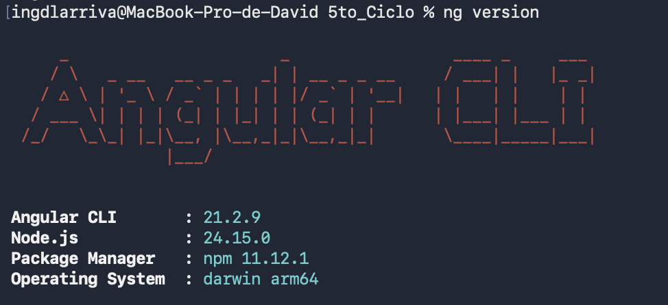
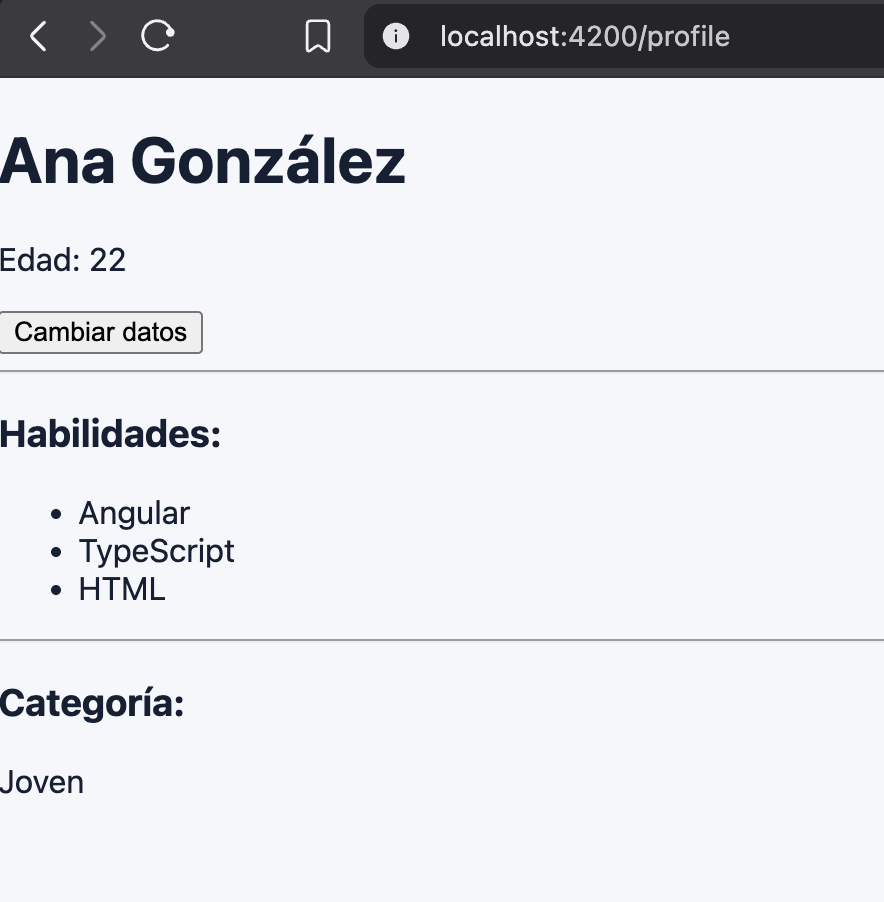

# Prácticas de Angular 21 - PPW

**Autor:** David Alejandro Larriva Castillo
**Institución:** Universidad Politécnica Salesiana (UPS)

## Propósito del Proyecto
Este repositorio contiene el proyecto incremental `ppw-angular-21` creado con Angular 21, sin Server-Side Rendering (`ssr=false`). El objetivo principal es establecer una estructura escalable basada en características (`features`) y aplicar los conceptos modernos del framework.

### Práctica 01: Instalación y Configuración
- Creación de la carpeta `features/home/pages/` para aislar los componentes.
- Configuración de un enrutador global con una ruta raíz (`''`) y ruta comodín (`'**'`).
- Limpieza del componente raíz (`app.component`) dejando únicamente el `<router-outlet />`.

### Práctica 02: Fundamentos de Angular
- Extensión del proyecto mediante la creación de la feature `profile`.
- Implementación de estado local moderno utilizando `signal` y datos derivados con `computed`.
- Renderizado declarativo utilizando la nueva sintaxis de control de flujo (`@if`, `@for`, `@switch`).
- Navegación entre la página de inicio y el perfil mediante `routerLink`.

## Evidencias
Las capturas de pantalla que validan la correcta ejecución de las prácticas se encuentran alojadas en el directorio de `evidencias/assets/`:

### Evidencias - Práctica 01
**1. Salida de ng version en la terminal:**

**2. Proceso de creación del proyecto con Angular CLI:**

**3. Página de bienvenida de Angular antes de modificar:**

**4. HomePage funcionando en localhost:4200:**

### Evidencias - Práctica 02
**5. ProfilePage funcionando con Signals y Control de Flujo:**

## Instrucciones de Ejecución
Para arrancar el servidor de desarrollo local, clona este repositorio y ejecuta los siguientes comandos en la terminal utilizando `pnpm`:

    pnpm install
    pnpm start